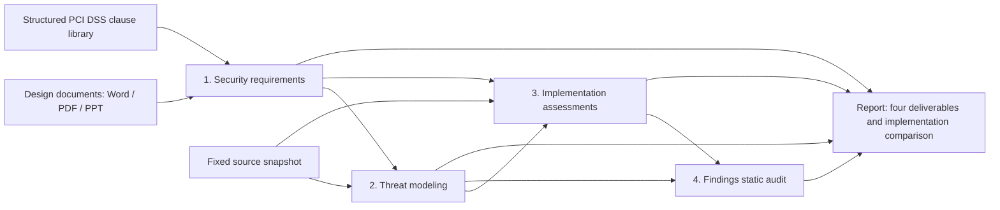

# PAthena

[中文](README.md) | **English**

PAthena is a group of security analysis agents for design reviews and code delivery. Given project design documents and source code, it extracts security requirements from the design, matches and binds compliance controls prepared and stored in the standards library, builds a threat model from the code, checks each requirement against its implementation, and then audits for vulnerabilities and consolidates the implementation comparison.

The workflow produces four deliverables: **security requirements, a threat model, requirement implementation assessments, and Findings**. Requirements identify their design or standard sources. Implementation checks correspond to individual requirements. Findings identify the relevant code, explain the impact, and provide recommendations.

## What it is useful for

- **Design reviews**: Organize assets, roles, data flows, and security controls from Word, PDF, and PowerPoint design documents. Extract explicit requirements and additional requirements inferred from design risks, with acceptance criteria for each requirement.
- **Compliance requirement analysis**: Match design security requirements to structured PCI DSS v4.0.1 clauses already stored in the database. Use the design context to select and bind relevant or potentially relevant stored compliance controls while preserving clause sources and applicability conditions.
- **Delivery acceptance**: Check each security requirement against the actual source code. Identify implementation support, partial implementation, requirement violations, and controls that need configuration or other material before a conclusion can be reached.
- **Security audits**: Investigate candidate vulnerabilities using the code architecture, trust boundaries, and attack paths. Present independent code audit results alongside requirement implementation gaps to help plan remediation and further verification.

An analysis can therefore answer both “What candidate security problems exist in the code?” and “How much of the security design is implemented, and what gaps remain?” Even when a rule scan does not flag a vulnerability, an implementation check can still record a design requirement as unmet or not yet established.

Compliance clauses are first filtered against the assessed design and code subsystem. Unrelated organizational, personnel, or physical controls do not become requirements or implementation checks; their exclusion reasons remain in the matching records. Relevant security requirements that depend on deployment or operations are retained as “Cannot verify from code.” Missing deployment material does not create an implementation defect. “Insufficient code evidence” means the static investigation cannot yet reach a conclusion. Standard testing procedures such as interviews and on-site observations are not code acceptance criteria.

## How the agents work together

Roles run through a shared Google ADK framework. The workflow determines stage order, task scope, and conditional branches. Each role uses its own versioned skills, prompts, tools, and result structure. Independent requirement tasks within a stage can run up to the configured concurrency limit. Upstream artifacts are persisted for later roles to read; the application validates responses and stores them in the database.

| Responsibility | Actual roles | Tasks |
| --- | --- | --- |
| Design analysis | `design_analyst` | Extract assets, modules, roles, data flows, and controls; distinguish document statements from analytical inferences |
| Security requirement generation | `requirement_generator` | Turn design facts into security requirements, source explanations, and individual acceptance criteria |
| Standard matching and control binding | `pci_mapper`, programmatic binding service | Query precomputed clause/control vectors, assess relevance, and bind stored bilingual control requirements |
| Requirement review | `requirement_reviewer` | Automatically review wording, duplicates, sources, and checkability; preserve original requirements and review results |
| Code understanding | `history`, `structural_index`, `architect` | Organize code context and structural indexes; establish the actual architecture and module relationships |
| Threat modeling | `threat_modeler` | Analyze code entry points, assets, trust boundaries, and possible attack paths |
| Requirement implementation checks | `requirement_checker` | Investigate source code independently for each requirement and return results and code locations for every acceptance criterion |
| Vulnerability planning and research | `planner`, `researcher` | Plan investigations using the threat model and requirement gaps; research candidate security problems along code paths |
| Findings deduplication and review | `deduplicator`, `reviewer`, `critic` | Merge duplicates, review static conclusions, seek counterexamples, and retain excluded findings |
| Attack chains and risk analysis | `chainer`, `calibrator` | Analyze possible relationships between findings when static review conditions are met, and assess risk |
| Reflection and reporting | `reflector`, `reporter` | Organize investigation results and audit reports; the product report module consolidates the four deliverables |

Document analysis, standard matching, requirement checks, and static code audits work together in one workflow. The static audit engine selects subsequent branches based on investigation results; the progress of each investigation determines which roles are needed. Requirement gaps are passed to vulnerability planning as investigation leads; further analysis determines whether they represent exploitable problems.

The current workflow generates and reviews requirements automatically, with no mandatory human approval of the requirement baseline. All analysis is static and does not run the target program. Dynamic reproduction and automatic patching stages have been removed from the execution workflow.

## Four deliverables

| Stage | Inputs and processing | Outputs |
| --- | --- | --- |
| 1. Security requirements | Parse design documents; extract design facts, explicit requirements, and inferred requirements; match requirements to structured PCI DSS clauses; bind prepared compliance requirements and review them automatically | Requirements, acceptance criteria, design sources, related clauses, and applicability conditions |
| 2. Threat modeling | Read a fixed source snapshot and use design and requirement context to establish actual architecture, entry points, trust boundaries, and attack paths | A threat model grounded in code and specific threats |
| 3. Requirement implementation assessments | Create an independent task for each requirement; use the code model and source navigation to investigate entry points, shared controls, and error paths; check each acceptance criterion | Static assessment results corresponding to each requirement, reasoning, and source locations |
| 4. Findings | Use the threat model and implementation gaps for planning, research, deduplication, static review, criticism, attack chain analysis, and risk assessment; the final report consolidates the vulnerability audit and implementation comparison | Candidate vulnerabilities, implementation or design gaps, impact, causes, recommendations, and code locations; excluded candidates are retained separately |



Security requirements and implementation checks share a stable identifier such as `SR-001` within each run. Each requirement has an independent check task and may contain multiple acceptance criteria. Every criterion must be submitted exactly once. Results distinguish static support, partial implementation, requirement violations, unknowns, and external evidence requirements. Tasks that have not been checked remain incomplete. Failure to locate a local code fragment does not establish that a control is absent: the check must also investigate shared middleware, other modules, or external responsibilities.

For example, suppose the design requires that “a disabled account must no longer access protected resources.” The system first records the requirement and acceptance criteria. It then uses the code model to locate login entry points, token validation, and shared authorization paths, and checks whether account disabling covers those paths. If the source behavior conflicts with the requirement, the report retains the implementation gap and its code location. Vulnerability research then investigates attack preconditions and impact. If the conclusion depends on runtime configuration, the result explicitly requests external material.

## How it differs from SAST

SAST (Static Application Security Testing) and PAthena can both analyze source code without executing the target program. Common rule- or query-driven SAST tools primarily check dangerous patterns, data flows, and vulnerability rules in code. PAthena adds design and standard requirement analysis before the static code audit, checks implementation against those project-specific requirements, and links the threat model, implementation gaps, and Findings.

| Dimension | Common rule- or query-driven SAST | PAthena |
| --- | --- | --- |
| Starting point | Source code, rules, and queries; some tools also read build or configuration material | Design documents, a fixed source snapshot, and a structured standards library |
| Source of security requirements | Built-in or custom vulnerability rules, security patterns, and queries | Explicit design requirements, requirements inferred from design risks, and compliance requirements derived from matched standard clauses |
| Architecture and threats | Usually analyzes program structure, data flows, and rules; capabilities vary by tool | Explicitly establishes architecture, trust boundaries, entry points, and attack paths from code for subsequent investigation |
| Implementation comparison | Checks code for issues described by rules; custom rules can express business controls | Creates an independent task for each security requirement, checks each acceptance criterion, and retains requirement identifiers, reasoning, and source locations |
| Vulnerability investigation | Rules or queries locate candidate issues and provide code locations or data flow paths | Agents continue investigating using the threat model, requirement gaps, and actual source code, followed by deduplication, static review, and criticism |
| Compliance results | Some tools map rules to standards or provide compliance classifications | Matches design requirements to structured standard clauses, preserves technical relevance and applicability conditions, and checks the implementation of related controls |
| Main outputs | Candidate issues, classifications, severity, and code locations, among other results | Security requirements, a threat model, requirement implementation assessments, Findings, and their relationships |

This comparison describes common workflows. Individual SAST products can also support custom business rules, model-based analysis, or requirement management integrations. The tools can be used together: rule scans check the code patterns they cover, while PAthena further organizes the project's design requirements, threats, and implementation comparison. The current version does not provide a dedicated import workflow for external SAST results.

PAthena's implementation verification is a **static assessment**. Code support does not establish that a deployment is correctly configured, and a requirement gap does not automatically imply an exploitable vulnerability. Unrelated organizational or personnel controls are automatically excluded. Relevant security requirements that depend on deployment are labeled “Cannot verify from code.” A related PCI DSS clause does not establish that the project formally falls within its scope, and the report does not provide compliance certification.

## Technology stack

- Backend: Python 3.12, FastAPI, Google ADK, LiteLLM, Pydantic.
- Frontend: TypeScript, React, Vite, Ant Design.
- Database: SQLite, WAL, FTS5; persistence for the structured standards library, tasks, raw model responses, and results.
- Document parsing: Docling. Source navigation: structural indexes, search tools, and local tree-sitter grammars.
- Analysis model: Currently only DeepSeek-V4.1-Flash is supported (API model name `deepseek-flash`), accessed through a separate model gateway.
- Deployment: Two containers for the analysis service and model gateway. The analysis service serves the frontend from the same origin.

English is the default output language. Selecting Chinese in system settings directly instructs subsequent analysis through skills and prompts to generate Chinese content. Existing results are not translated afterward. Each run freezes its own output language.

## Analysis model support and constraints

The current analysis-model support scope is limited to **DeepSeek-V4.1-Flash**, configured as `AUDITOR_MODEL_ID=deepseek-flash`. Integration and real analysis experiments use this API identifier. Other models, providers, and small local models have not passed compatibility and complete-workflow acceptance and are outside the current support scope. A configurable model name does not establish compatibility with arbitrary models.

As of 2026-10-09, DeepSeek's documentation maps `deepseek-flash` to DeepSeek-V4.1-Flash, with a **1M context window** and support for JSON Output and Tool Calls. The provider may change the version behind an API alias; check the [official model documentation](https://api-docs.deepseek.com/zh-cn/quick_start/pricing/) when deploying.

| Constraint | Current requirement and reason |
| --- | --- |
| Model interface | The gateway currently connects to `api.deepseek.com` and accepts only the registered model name and approved parameters. Other providers require adaptations for interfaces, parameters, tool protocols, and error handling. |
| Context window | Retain the current large-context model. **Replacing it with an 8K, 16K, or 32K small-context analysis model is not recommended.** Context includes complete skills, design and code material, tool schemas, call history, and tool results. Insufficient capacity can cause rejected requests, incomplete material inclusion, or inadequate cross-module analysis. |
| Tools and structured output | Reliable tool calling and complete arguments conforming to strict schemas are required. Chat capability or JSON text output alone is insufficient for the full workflow. The application also validates task ownership, sources actually read, and acceptance-criterion inventory. |
| Per-response output | The current default output budget is **16,384 tokens**. Requirements, threat models, and audit results can be large structured objects; reducing the budget can cause truncated arguments, missing inventory, or failed submissions. Provider output capacity and the application's configured response budget are separate limits. |
| Instruction following and reasoning | The model must follow skills, source constraints, bilingual output instructions, and cross-file investigations consistently. Smaller analysis models have not passed acceptance; successful tool calling does not establish accurate security judgments. |

Material grouping, on-demand code slicing, retrieval, and some context-budget checks are implemented. **Unified capability detection and end-to-end context adaptation for arbitrary models are not implemented.** A smaller window does not guarantee that all tasks will be split automatically while preserving analytical completeness. Unlimited cumulative tokens do not increase the model's context window or per-response capacity.

These constraints apply to the language model performing requirement analysis, threat modeling, implementation checks, and Findings audits. Local Qwen embeddings and BGE reranking serve retrieval; their selection and evaluation are described below.

## Container deployment

Docker Compose is required. Before the first startup, create local configuration and directories for input material:

```sh
cp .env.example .env
mkdir -p inputs models standards
```

Edit `.env` and set `DEEPSEEK_API_KEY`. The key is provided only to the model gateway. `.env`, input material, original standards, models, databases, and reports are excluded from version control.

```sh
docker compose --env-file .env -f deploy/compose.yaml build
docker compose --env-file .env -f deploy/compose.yaml up -d
```

Open <http://127.0.0.1:8088>. The project list is empty on first startup. Create a project, upload a design document, and select a source repository to start analysis.

Target source code can be placed in `inputs/project`. Configure it in `.env`:

```dotenv
AUDITOR_REPOSITORIES={"project":"/inputs/project"}
```

You can also use the template for mounting an external repository read-only:

```sh
mkdir -p deploy/local
cp deploy/compose.repositories.example.yaml deploy/local/repositories.yaml
```

Set `AUDITOR_REPOSITORY_DIR` in `.env` to the repository's absolute host path, and edit the registered name in the template as needed. Start with the additional configuration:

```sh
docker compose --env-file .env -f deploy/compose.yaml -f deploy/local/repositories.yaml up -d
```

The gateway forwards requests only to `api.deepseek.com` and rejects redirects to other hosts. The analysis service has only an internal network. Compose does not currently provide an operating-system-level domain firewall; the deployment environment must enforce the corresponding outbound restrictions. DeepSeek receives the material excerpts needed for analysis.

State is stored in the `auditor-state` volume. Regular service rebuilds preserve the data. Keep this volume when analysis results need to be retained.

## Document models and standards library

Docling uses local parsing models. Download the resources during installation preparation:

```sh
python3.12 -m venv .venv
.venv/bin/python -m pip install -r requirements.lock
.venv/bin/python -m pip install --no-deps -e .
.venv/bin/docling-tools models download layout tableformer --output-dir models/docling
```

To enable the parsing models inside the container, set this in `.env`:

```dotenv
AUDITOR_DOCLING_MODELS=/models/docling
```

Resource preparation is separate from analysis. The parsing process does not download resources online. Word, PowerPoint, and PDFs with text are currently supported. OCR for scanned pages and interpretation of diagram semantics need further work.

The PCI DSS source document and structured standards package are not distributed with the repository. Import your own PCI DSS v4.0.1 PDF offline:

```sh
.venv/bin/python -m pip install -e '.[standards]'
.venv/bin/python -m security_auditor.standards /path/PCI-DSS-v4_0_1.pdf standards/pci-dss-4.0.1
```

The import directory must be empty. Use `--provenance /path/source.json` to include a source record. The importer preserves the original PDF, clause text, applicability notes, testing procedures, guidance, and source digests. It does not call a model to rewrite the standard.

Prepare control requirements independently and provide a source-grounded `controls.jsonl` in the standard directory, including control types, verification methods, and English/Chinese requirements and acceptance criteria. Retrieval uses local Qwen3-Embedding-0.6B embeddings and BGE-reranker-v2-m3 reranking. Download pinned resources during installation; analysis runs offline:

```sh
.venv/bin/python -m pip install -e '.[embeddings]'
.venv/bin/python tools/download_retrieval_models.py --output-dir ./models
auditor prepare-standard --standard-pack ./standards/pci-dss-4.0.1 --model-dir ./models/embeddings/qwen3-embedding-0.6b --reranker-dir ./models/rerankers/bge-reranker-v2-m3
```

Preparation persists controls, normative-source and bilingual-control vectors, lexical indexes, model identities, and the retrieval recipe. Identical inputs reuse existing preparation. Configure `AUDITOR_STANDARD_PACK=/standards/pci-dss-4.0.1`, `AUDITOR_EMBEDDING_MODEL_DIR`, and `AUDITOR_RERANKER_MODEL_DIR`. Projects query stored vectors and embed only new queries. Dense and BM25 rankings are fused with RRF, then the first 40 candidates are reranked locally; remaining candidates are still accessible through pagination. Results are cached across projects by catalog, query, language, and section; pagination does not rerun the models. Each catalog has its own lexical index so new standard versions do not alter historical keyword rankings.

Rankings and scores are candidates, not applicability decisions or compliance probabilities. The mapper reads stored controls and normative sources to assess relevance and conditions. A binding service then copies stored control text and criteria in the run language without calling a compliance requirement generator. Changing controls, models, or retrieval recipes requires explicit preparation of a new catalog; mismatched models block new runs before analysis starts. Existing catalogs and results are preserved. Source reads do not reparse the PDF. An incomplete standard catalog cannot enter new compliance runs; an unconfigured standard skips compliance steps. See [Embedding and reranking evaluation](#embedding-and-reranking-evaluation) below for selection and test limits.

## Embedding and reranking evaluation

Retrieval matches project security requirements to stored standard controls. The embedding model retrieves semantic candidates, BM25 adds keyword matches, and the reranker compares each query with its candidate controls to reorder the first 40. The selected pipeline is **Qwen3-Embedding-0.6B + bilingual hybrid retrieval + BGE-reranker-v2-m3**.

Comparison was completed in a separate workspace before migration into the application:

1. **Freeze sources and cases.** The corpus contains 279 normative PCI DSS v4.0.1 clauses and 290 previously generated controls. The 108 queries and source-grounded labels were fixed before running candidate models: 100 positives covering 50 bilingual scenario pairs, plus 8 unrelated queries. The development set has 26 positives and the original test set has 74; both languages of a scenario always share their split.
2. **Compare embedding retrieval.** E5-small, BGE-M3, and Qwen3-Embedding-0.6B were evaluated with bilingual vectors and with added BM25; the original English-control index serves as the baseline. Normative sources retain their original language. The bilingual catalog contains 859 vectors. Hits are aggregated by control ID so language variants do not occupy multiple candidate positions. Qwen hybrid retrieval was selected using development-set bilingual Recall@30 eligibility, Recall@10, MRR, and latency.
3. **Compare rerankers.** Both rerankers use the same candidate pool, fixed RRF `k=60`, and the first 40 candidates. Official model revisions and inference protocols are pinned. Ranking comes from model scores without generating and interpreting prose; overlong reranking inputs fail instead of being silently truncated. Full-catalog reranking overhead was also measured on eight predefined queries.
4. **Accept and migrate.** After selecting the production combination, ten queries targeting previously untested controls were fixed. Further checks exercised real application CPU models, SQLite retrieval, cross-project caching, pagination, and bilingual retrieval inside the container. Test databases were separate from production and added no test projects to the system. No DeepSeek or other paid model API was called.

The table reports the original test set of 74 positives. Recall@10 / @30 measures labeled targets retrieved within the first 10 / 30 positions; multi-target queries receive fractional credit. MRR is the mean reciprocal rank of the first labeled target, with higher values indicating better ranking.

| Pipeline | Recall@10 | Recall@30 | MRR |
| --- | ---: | ---: | ---: |
| E5-small, original English-control index | 97.3% | 100% | 0.874 |
| E5-small, bilingual vectors | 95.3% | 99.3% | 0.836 |
| E5-small, bilingual hybrid | 96.6% | 100% | 0.861 |
| BGE-M3, bilingual vectors | 97.3% | 99.3% | 0.863 |
| BGE-M3, bilingual hybrid | 98.0% | 100% | 0.888 |
| Qwen3-Embedding-0.6B, bilingual vectors | 99.3% | 99.3% | 0.930 |
| Qwen3-Embedding-0.6B, bilingual hybrid | 97.3% | 100% | 0.924 |
| Qwen hybrid + BGE reranking (selected) | **100%** | **100%** | **0.950** |
| Qwen hybrid + Qwen reranking | 98.6% | 98.6% | 0.949 |

Qwen reranking narrowly won the predefined development-set MRR rule, but placed one Chinese target outside the first 30 on the original test set. BGE was therefore selected for observed recall and lower latency. **The original test set informed engineering selection and is not independent acceptance.** All expected targets ranked first in the ten new acceptance queries and in the application retest after migration. All 247 application tests passed.

Performance was measured on Apple arm64 with 16 GiB RAM, CPU FP32, four threads, and batches of eight. Qwen query embedding P50 was approximately 0.09 s. On eight fixed queries, reranking 40 candidates took BGE CPU **P50 / P95 4.15 / 4.71 s**, versus **7.82 / 8.78 s** for Qwen. These timings cover only reranking, excluding loading, embedding, and database access. Full reranking accuracy runs used Apple GPU FP32; top-one and labeled-target positions agreed in 16 CPU/GPU comparisons across the two rerankers. GPU process-memory figures exclude driver memory.

Two deployed-container queries took 31.46 s end to end (including first load) and 21.03 s; cached repeats took 0.40 s and 0.29 s. These two observations are not P50/P95 estimates, and host timings should not be presented as container response times.

**Evaluation scope:** cases were authored for this development task from normative sources and have not undergone independent expert review. The reported 100% applies only to this dataset; it does not establish whole-standard accuracy, compliance success, or final mapper decision accuracy. Unlabeled candidates are not automatically false positives, and eight unrelated queries are insufficient to calibrate applicability thresholds. Pinned revisions are recorded in the [model download script](tools/download_retrieval_models.py). Model weights, standard originals, and per-query source data are not distributed with the repository.

## Analysis modes

- `full`: Design requirements, standard matching, code modeling, implementation checks, and Findings.
- `requirements_only`: Analyze only design documents and standard requirements.
- `code_only`: Run only code threat modeling and static Findings audits, without reading design documents.
- `implementation_only`: Import successfully submitted requirements and sources from an existing run in the same project, and check only their implementation.

Selecting source code without uploading a document uses code mode. Existing requirements can be checked through the “Check existing requirements” action. The API's `implementation_only` mode accepts `baseline_run_id` and `repository_id`, preserves the original requirement language, records relationships between runs, and retains historical results.

## Budgets, result submission, and recovery

API request counts, cumulative tokens, and per-task model call limits are temporarily disabled, with `AUDITOR_ENFORCE_BUDGETS=false` by default. This switch applies to the analysis service, outbound gateway, ADK, and static audit adapter. Saved budgets on historical runs no longer block execution, while original budgets and cumulative usage are retained. Budget settings are hidden in the UI, new analyses have no limits, and legacy limits submitted through the API have no effect.

To restore limits, set `AUDITOR_ENFORCE_BUDGETS=true` in both the analysis service and gateway, then configure `AUDITOR_MAX_REQUESTS`, `AUDITOR_MAX_TOKENS`, and `AUDITOR_AGENT_MAX_CALLS`. All default to `0`, meaning unlimited. Budget controls then become available in the UI. In the API, `null` for `budget.max_requests` or `budget.max_tokens` means unlimited. Per-response output length, context capacity, concurrency, timeouts, and retry limits remain in place; these are separate from cumulative consumption limits.

Each actual outbound request is reserved and accounted for atomically. Known provider usage, in-flight reservations, and estimates for unknown usage are displayed separately; estimates are not invoices. Connection failures, rate limits, and temporary service errors use bounded retries and recovery waits. Authentication, balance, parameter, and result contract issues retain explicit errors. A user pause stops automatic wake-ups.

Project-defined roles use strict function argument contracts. Responses are archived first, then validated for schema, task ownership, sources, and acceptance-criterion inventory before transactional database submission. The application does not fabricate analytical fields, infer results from prose, or call another model to interpret or repair the final response. The application supplies fixed task relationships and rejects conflicting relationships returned by a model.

Security judgments can cite only material actually read in the current session. Search results, summaries, and historical reads do not replace current source reads. Conclusions of implementation support, partial implementation, or requirement violations must have actual source references. Static audits use investigation loops to submit structured conclusions, with no dynamic reproduction or target program execution permissions.

Results can be exported as HTML, CSV, and JSON. Reports retain requirement relationships, sources, code locations, and excluded candidates. Deployment does not guarantee that model output will always be valid. When final structure or source validation fails, the task remains incomplete and requires the blocking issue to be addressed before continuing.

## Local development and validation

```sh
python3.12 -m venv .venv
.venv/bin/python -m pip install -r requirements.lock
.venv/bin/python -m pip install --no-deps -e .
.venv/bin/python -m pip install -e '.[dev]'
cd apps/web
pnpm install --frozen-lockfile
pnpm run build
cd ../..
.venv/bin/pytest -q
.venv/bin/ruff check src tests --exclude vendor
.venv/bin/auditor doctor
```

Local startup does not automatically load `.env`; provide configuration to the corresponding processes. Set `DEEPSEEK_API_KEY` only for the gateway process and point `AUDITOR_GATEWAY_DATABASE` to the same database used by the analysis service:

```sh
AUDITOR_GATEWAY_DATABASE=./state/auditor.sqlite3 .venv/bin/auditor gateway
```

In another terminal, register the repository, parsing models, and standards package, then start the analysis service:

```sh
AUDITOR_REPOSITORIES='{"project":"/absolute/path/to/project"}' \
AUDITOR_DOCLING_MODELS=./models/docling \
.venv/bin/auditor serve --port 8088
```

PDF tests require models prepared in advance and explicitly skip when resources are missing. Protocol tests use controlled model responses and do not establish real-world analysis accuracy. The first complete run with a real model required debugging and resumptions. Fully unattended stability and the validity of Findings have not yet passed acceptance testing.

## Project structure

```text
apps/web/                  Frontend
src/security_auditor/      Backend, database, model gateway, and adapters
skills/                    Project-defined versioned analysis skills
design/                    Workflow and configuration examples
deploy/                    Containers and general deployment templates
tests/                     Automated tests and minimal test fixtures
licenses/                  Third-party licenses
```

The internal name `security-design-auditor` is used for the package and Compose project.
