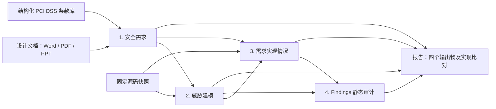

# PAthena

**中文** | [English](README.en.md)

PAthena 是一套面向设计评审和代码交付的安全分析智能体群。输入项目设计文档和源码，系统从设计中提取安全需求，匹配标准库中预先生成并入库的合规控制需求，再从代码建立威胁模型、逐项检查需求的实现情况，最后进行漏洞审计并汇总实现比对结果。

整个流程围绕四个输出物组织：**安全需求、威胁模型、需求实现情况、Findings**。需求说明来自哪份设计材料或哪条标准；实现检查与需求一一对应；Findings 说明问题涉及哪段代码、产生什么影响，以及建议如何处理。

## 有什么用

- **设计评审**：从 Word、PDF、PPT 设计材料中整理系统资产、角色、数据流和安全控制，提取明确要求及基于设计风险推导的补充要求，并为每项需求建立可检查的验收条件。
- **合规需求分析**：将设计安全需求匹配到已入库的结构化 PCI DSS v4.0.1 条款，结合设计背景选取并绑定预先保存的相关或可能相关控制要求，保留条款来源与适用条件。
- **交付验收**：对照实际源码检查每条安全需求，识别实现支持、部分实现、需求违反，以及需要配置或其他材料才能判断的控制。
- **安全审计**：依据代码架构、信任边界和攻击路径调查候选漏洞，将独立代码审计结果与需求实现缺口一起呈现在报告中，便于确定后续整改和验证工作。

因此，一次分析既能回答“代码里有哪些候选安全问题”，也能回答“设计要求的安全控制，代码究竟实现了多少、还有哪些缺口”。即使规则扫描没有命中某种漏洞，一项设计要求仍可以通过实现检查被记录为未满足或尚无法确认。

合规条款先按本次设计和代码子系统的范围筛选，无关的组织、人员或物理控制不进入需求及实现检查；排除理由保存在匹配记录中。相关安全需求如果依赖实际部署或运营，保留需求并标记“无法通过代码验证”，不会因缺少部署材料就生成实现缺陷。“代码检查依据不足”则表示源码调查仍不足以得出结论。访谈、现场观察等标准测试程序不会被当作代码验收要求。

## 智能体群如何分工

各角色通过统一的 Google ADK 框架运行，由工作流安排阶段顺序、任务范围和条件分支。每个角色使用自己的版本化技能、Prompt、工具与结果结构；同阶段的独立需求任务可在设定并发范围内执行。上游产物持久化后供后续角色读取，程序校验返回并写入数据库。

| 分工 | 实际角色 | 职责 |
| --- | --- | --- |
| 设计分析 | `design_analyst` | 提取设计中的资产、模块、角色、数据流和控制，区分文档声明与分析推断 |
| 安全需求生成 | `requirement_generator` | 从设计事实形成安全需求、来源说明和逐项验收条件 |
| 标准匹配与控制绑定 | `pci_mapper`、程序绑定服务 | 查询预计算标准与控制向量，判断相关性，直接绑定已保存的双语控制需求 |
| 需求复核 | `requirement_reviewer` | 自动检查需求的表达、重复项、来源和可检查性，保留原需求与复核结果 |
| 代码理解 | `history`、`structural_index`、`architect` | 整理代码背景和结构索引，建立实际架构与模块关系 |
| 威胁建模 | `threat_modeler` | 分析代码入口、资产、信任边界和可能的攻击路径 |
| 需求实现检查 | `requirement_checker` | 每项需求独立调查源码，逐条返回验收结果和代码位置 |
| 漏洞规划与研究 | `planner`、`researcher` | 根据威胁模型和需求缺口安排调查，沿代码路径研究候选安全问题 |
| Findings 去重与复核 | `deduplicator`、`reviewer`、`critic` | 合并重复问题，检查静态结论，寻找反证并保留排除结果 |
| 攻击链与风险分析 | `chainer`、`calibrator` | 在满足静态复核条件时分析问题之间的可能关联，并评定风险 |
| 反思与报告 | `reflector`、`reporter` | 整理调查结果和审计报告，由产品报告模块汇总四个输出物 |

文档分析、标准匹配、需求检查与静态代码审计在同一工作流中协作。静态审计引擎根据调查结果选择后续分支，每条 Finding 所需的角色由调查进展决定。需求缺口会交给漏洞规划作为调查线索，是否构成可利用问题仍需进一步分析。

当前流程全自动生成和复核需求，没有人工审批需求基线的必经步骤。分析完全静态，不运行目标程序；动态复现和自动补丁阶段已从执行工作流移除。

## 四个输出物

| 阶段 | 输入与处理 | 输出 |
| --- | --- | --- |
| 1. 安全需求 | 解析设计文档，提取设计事实、明确要求和推导要求；将需求匹配到结构化 PCI DSS 条款，绑定预先保存的相关合规需求并自动复核 | 需求、验收条件、设计来源、关联条款与适用条件 |
| 2. 威胁建模 | 读取固定源码快照，结合设计与需求背景，建立实际架构、入口、信任边界和攻击路径 | 基于代码的威胁模型与具体威胁 |
| 3. 需求实现情况 | 每项需求创建独立检查任务，借助代码模型和源码导航调查入口、共享控制及错误路径，逐条检查验收条件 | 与需求一一对应的静态检查结果、判断理由和源码位置 |
| 4. Findings | 结合威胁模型及实现缺口进行规划、研究、去重、静态复核、质疑、攻击链分析和评级；最终报告汇总漏洞审计与需求实现比对 | 候选漏洞、实现或设计缺口、影响、原因、建议和代码位置；已排除候选单独保留 |



安全需求与实现检查共用运行内稳定的 `SR-001` 编号：每项需求对应独立检查任务，一项需求内可以有多个验收条件，每条验收条件必须恰好提交一次。检查结果区分静态支持、部分实现、违反需求、无法确认及需要外部材料；未检查的任务保留未完成状态。没有搜到某段局部代码，不能直接证明控制缺失，检查还需寻找公共中间件、其他模块或外部责任。

例如，设计要求“账号禁用后不得继续访问受保护资源”。系统先将其整理为安全需求和验收条件，再从代码模型定位登录入口、令牌验证及共享鉴权路径，逐项检查禁用控制是否覆盖这些路径。如果源码行为与要求冲突，报告会保留该需求的实现缺口及代码位置，漏洞研究角色再调查其攻击前提和影响；如果需要运行时配置才能判断，就明确记录需要外部材料。

## 与 SAST 的区别

SAST（静态应用安全测试）与 PAthena 都可以在不运行目标程序的情况下分析源码。常见规则或查询驱动的 SAST 以代码中的危险模式、数据流和漏洞规则为主要检查依据；PAthena 在静态代码审计前加入设计需求和标准需求分析，再用这些项目自身的要求检查实现，并将威胁模型、实现缺口和 Findings 关联起来。

| 比较维度 | 常见规则或查询驱动的 SAST | PAthena |
| --- | --- | --- |
| 分析起点 | 源码、规则与查询，部分工具还读取构建或配置材料 | 设计文档、固定源码快照、结构化标准库 |
| 安全要求来源 | 内置或自定义漏洞规则、安全模式及查询 | 设计中的明确要求、依据设计风险推导的要求、匹配标准条款后形成的合规需求 |
| 架构与威胁 | 通常围绕程序结构、数据流及规则分析；具体能力随工具而异 | 显式建立基于代码的架构、信任边界、入口与攻击路径，供后续调查使用 |
| 实现比对 | 根据规则检查代码是否出现相关问题；业务控制可通过自定义规则表达 | 为每项安全需求建立独立任务，逐条检查验收条件，保留需求编号、判断理由与源码位置 |
| 漏洞调查 | 规则或查询定位候选问题，提供代码位置或数据流路径 | 智能体结合威胁模型、需求缺口和实际源码继续调查，并进行去重、静态复核和质疑 |
| 合规结果 | 有些工具提供规则与标准的映射或合规分类 | 将设计需求与结构化标准条款匹配，保留技术相关性和适用条件，再检查相关控制的实现 |
| 主要输出 | 候选问题、分类、严重性及代码位置等 | 安全需求、威胁模型、需求实现情况、Findings 四个输出物，以及它们的关联关系 |

这个比较描述常见工作方式，具体 SAST 产品也可以扩展业务规则、加入模型分析或接入需求管理。两类工具可以配合使用：规则扫描检查其覆盖的代码模式，PAthena 进一步组织项目的设计要求、威胁和实现比对。当前版本尚未提供外部 SAST 扫描结果的专用导入流程。

PAthena 的需求实现验证是**静态判断**：代码有支持并不等于部署已正确配置，需求缺口也不自动等于可利用漏洞。无关的组织或人员控制自动排除；相关且依赖实际部署的安全要求标为“无法通过代码验证”。PCI DSS 条款相关不等于项目已正式纳入该条款适用范围，报告不提供合规认证结论。

## 技术栈

- 后端：Python 3.12、FastAPI、Google ADK、LiteLLM、Pydantic。
- 前端：TypeScript、React、Vite、Ant Design。
- 数据库：SQLite、WAL、FTS5；结构化标准库、任务、原始模型返回和结果持久化。
- 文档解析：Docling；源码导航：结构索引、检索工具与本地 tree-sitter 语法资源。
- 模型：默认 DeepSeek `deepseek-flash`，通过独立模型网关调用。
- 部署：分析服务和模型网关两个容器，前端由分析服务同源提供。

默认输出语言为英文。系统设置选择中文后，后续分析的技能和 Prompt 直接要求中文生成，不对已有结果做二次翻译；每次分析冻结自己的输出语言。

## 容器部署

需要 Docker Compose。首次启动前创建本地配置并准备材料目录：

```sh
cp .env.example .env
mkdir -p inputs models standards
```

编辑 `.env`，填写 `DEEPSEEK_API_KEY`。密钥只提供给模型网关；`.env`、输入材料、标准原文、模型、数据库和报告均不进入版本控制。

```sh
docker compose --env-file .env -f deploy/compose.yaml build
docker compose --env-file .env -f deploy/compose.yaml up -d
```

访问 <http://127.0.0.1:8088>。首次启动项目列表为空。创建项目、上传设计文档并选择源码仓库后即可开始分析。

目标源码可放在 `inputs/project`，在 `.env` 中配置：

```dotenv
AUDITOR_REPOSITORIES={"project":"/inputs/project"}
```

也可使用外部仓库只读挂载模板：

```sh
mkdir -p deploy/local
cp deploy/compose.repositories.example.yaml deploy/local/repositories.yaml
```

在 `.env` 中设置 `AUDITOR_REPOSITORY_DIR` 为宿主机仓库绝对路径，并按需要编辑模板内的登记名称。启动时叠加配置：

```sh
docker compose --env-file .env -f deploy/compose.yaml -f deploy/local/repositories.yaml up -d
```

网关只转发至 `api.deepseek.com`，拒绝跨主机重定向；分析服务只有内部网络。Compose 尚不提供操作系统级域名防火墙，需要部署环境落实相应出口限制。DeepSeek 会接收分析所需的材料片段。

状态保存在 `auditor-state` 卷内。常规服务重建会保留数据；不要在需要保留分析结果时删除该卷。

## 文档模型与标准库

Docling 使用本地解析模型。可在安装准备阶段下载资源：

```sh
python3.12 -m venv .venv
.venv/bin/python -m pip install -r requirements.lock
.venv/bin/python -m pip install --no-deps -e .
.venv/bin/docling-tools models download layout tableformer --output-dir models/docling
```

容器内启用解析模型时，在 `.env` 设置：

```dotenv
AUDITOR_DOCLING_MODELS=/models/docling
```

资源准备与分析运行分开，解析进程不在线下载资源。当前支持 Word、PPT 和带文字的 PDF；扫描页 OCR 与图形语义覆盖仍有待完善。

PCI DSS 原文及结构化标准包不随仓库分发。使用自己的 PCI DSS v4.0.1 PDF 离线导入：

```sh
.venv/bin/python -m pip install -e '.[standards]'
.venv/bin/python -m security_auditor.standards /path/PCI-DSS-v4_0_1.pdf standards/pci-dss-4.0.1
```

导入目录必须为空。可用 `--provenance /path/source.json` 附带来源记录。导入器保留原 PDF、条款原文、适用性说明、测试程序、指导与来源摘要；不调用模型改写标准。

标准控制作为独立准备任务生成：在标准目录提供已生成、带原文来源的 `controls.jsonl`，包含控制类型、验证方式及中英文需求和验收条件。检索采用本地 Qwen3-Embedding-0.6B 向量模型与 BGE-reranker-v2-m3 重排模型；安装准备时下载固定版本，分析时完全离线：

```sh
.venv/bin/python -m pip install -e '.[embeddings]'
.venv/bin/python tools/download_retrieval_models.py --output-dir ./models
auditor prepare-standard --standard-pack ./standards/pci-dss-4.0.1 --model-dir ./models/embeddings/qwen3-embedding-0.6b --reranker-dir ./models/rerankers/bge-reranker-v2-m3
```

准备步骤保存控制目录、标准原文及中英文控制向量、关键词索引、模型和检索策略版本；相同内容重复执行直接复用。设置 `AUDITOR_STANDARD_PACK=/standards/pci-dss-4.0.1`、`AUDITOR_EMBEDDING_MODEL_DIR` 和 `AUDITOR_RERANKER_MODEL_DIR` 后，各项目查询已经入库的向量，只为新查询计算向量。向量召回与 BM25 关键词召回通过 RRF 合并，再本地重排前 40 项；其余候选仍可分页读取。同一目录、查询、语言和章节的检索结果跨项目缓存，翻页不重复重排。每个目录独立保存关键词索引，新增标准版本不会改变旧目录的关键词排名。

候选排名和模型分数不代表正式适用性或合规概率。mapper 读取已保存的控制及规范原文后判断关联与适用条件；绑定服务原样复制对应语言的已保存控制及验收条件，不再调用项目内的合规需求生成角色。控制、模型或检索策略更新需要显式准备新目录；模型不匹配会在新运行开始前阻断。旧目录和历史分析保留。原文读取不重新解析 PDF，未准备完的标准不能进入新项目合规分析；未配置标准包则跳过合规步骤。选型与测试范围见下文的 [向量模型与重排测试](#向量模型与重排测试)。

## 向量模型与重排测试

检索用于把项目安全需求匹配到已保存的标准控制。向量模型负责语义召回，BM25 补充关键词召回，重排模型再比较查询与候选控制，调整前 40 项的顺序。最终采用 **Qwen3-Embedding-0.6B + 中英文混合召回 + BGE-reranker-v2-m3**。

测试先在独立目录完成，再移植到应用，过程如下：

1. **固定资料与题目**：使用 PCI DSS v4.0.1 的 279 条规范性条款、290 项已生成控制；在运行候选模型前固定 108 条查询及来源。其中 100 条正例来自 50 组中英文对应场景，另有 8 条无关查询。开发集包含 26 条正例，原测试集包含 74 条，同一场景的两种语言始终在同一划分。
2. **比较向量召回**：比较 E5-small、BGE-M3、Qwen3-Embedding-0.6B，分别测量双语向量与加入 BM25 后的效果，并保留原英文控制索引作为基线。规范原文保持原语言；双语目录共 859 条向量。按控制 ID 聚合命中，多个语言版本不会占多个候选位置。用开发集的双语 Recall@30 门槛、Recall@10、MRR 和耗时选择 Qwen 混合召回。
3. **比较重排**：两个重排器使用同一候选池、固定 RRF 参数 `k=60` 和前 40 项候选。固定官方模型版本与推理协议，不通过生成文字再推断排名；过长重排输入报错，不静默截断。另对预先固定的 8 条查询测量全目录重排开销。
4. **新增验收与移植**：选定生产组合后，固定 10 条此前未测过的控制查询，再测试应用真实 CPU 模型、SQLite 查询、跨项目缓存、分页，以及容器内中英文检索。测试数据库独立于生产，未向系统添加测试项目；全部测试没有调用 DeepSeek 或其他付费模型 API。

下表为原测试集 74 条正例的结果。Recall@10 / @30 表示标注目标进入前 10 / 30 项的比例；多目标查询按实际命中比例计分。MRR 表示首个标注目标的排名倒数均值，越高越好。

| 配置 | Recall@10 | Recall@30 | MRR |
| --- | ---: | ---: | ---: |
| E5-small，原英文控制索引 | 97.3% | 100% | 0.874 |
| E5-small，双语向量 | 95.3% | 99.3% | 0.836 |
| E5-small，双语混合召回 | 96.6% | 100% | 0.861 |
| BGE-M3，双语向量 | 97.3% | 99.3% | 0.863 |
| BGE-M3，双语混合召回 | 98.0% | 100% | 0.888 |
| Qwen3-Embedding-0.6B，双语向量 | 99.3% | 99.3% | 0.930 |
| Qwen3-Embedding-0.6B，双语混合召回 | 97.3% | 100% | 0.924 |
| Qwen 混合召回 + BGE 重排（采用） | **100%** | **100%** | **0.950** |
| Qwen 混合召回 + Qwen 重排 | 98.6% | 98.6% | 0.949 |

按预先固定的开发集规则，Qwen 重排的 MRR 略高；它在原测试集把一项中文目标排到了前 30 项之外，因此工程选型采用召回更稳定、耗时更低的 BGE。**原测试集参与了工程选择，不作为独立验收。** 之后新增的 10 条查询及移植后的复测中，标注目标全部排名第一。247 项程序测试通过。

性能测试使用 Apple arm64、16 GiB 内存，CPU FP32、4 线程、批量 8。Qwen 查询向量 P50 约 0.09 秒。8 条固定查询的 40 项重排中，BGE 的 CPU P50 / P95 为 **4.15 / 4.71 秒**，Qwen 为 **7.82 / 8.78 秒**；只计重排，不含加载、向量生成及数据库读取。完整重排准确度测试在 Apple GPU FP32 上执行，两种重排模型共 16 条 CPU/GPU 对照的首位及标注目标位置一致。GPU 进程内存统计不包含驱动占用。

部署后的两条容器查询端到端分别为 31.46 秒（含首次加载）、21.03 秒，缓存查询为 0.40 秒、0.29 秒；这些只是两条实测，不能作为 P50/P95，也不能将宿主机计时当作容器响应时间。

**测试范围**：查询由本次开发任务依据规范来源整理，未经独立专家复核。上述 100% 仅适用于这份测试集，不能代表全标准准确度、合规通过率或 mapper 最终判断的准确度。未标注候选不直接视为误报，8 条无关查询也不足以校准适用性阈值。固定模型版本见 [模型下载脚本](tools/download_retrieval_models.py)。模型权重、标准原件及逐题来源数据不随仓库分发。

## 分析模式

- `full`：设计需求、标准匹配、代码建模、实现检查和 Findings。
- `requirements_only`：只分析设计文档和标准需求。
- `code_only`：只进行代码威胁建模与 Findings 静态审计，不读取设计文档。
- `implementation_only`：从同项目已有运行导入成功提交的需求和来源，只检查实现情况。

页面仅选择源码、不上传文档时使用代码模式。已有需求可通过“检查已有需求”继续执行实现检查。API 的 `implementation_only` 接受 `baseline_run_id` 与 `repository_id`；沿用原需求语言，记录新旧关联，保留历史结果。

## 预算、返回与恢复

当前暂时关闭 API 调用次数、累计 token 和单任务模型调用轮数上限，默认 `AUDITOR_ENFORCE_BUDGETS=false`。此开关同时应用于分析服务、出站网关、ADK 和静态审计适配层；历史运行已保存的预算也不再阻断执行，原预算与累计用量保留。界面隐藏额度设置，新分析一律不限额，API 传入的旧额度也不生效。

恢复限制时，在分析服务和网关同时设置 `AUDITOR_ENFORCE_BUDGETS=true`，再配置 `AUDITOR_MAX_REQUESTS`、`AUDITOR_MAX_TOKENS` 和 `AUDITOR_AGENT_MAX_CALLS`（默认均为 `0`，表示不限额）。此时页面可调整运行额度，API 的 `budget.max_requests` 和 `budget.max_tokens` 为 `null` 表示不限额。单次回答长度、上下文容量、并发、超时和故障重试限制继续保留；它们不属于累计消费上限。

每次实际出站请求都原子预留并记账，分别显示已知供应商用量、在途预留与未知用量估算；估算不等于账单。连接、限速和临时服务错误采用有界重试与等待恢复；认证、余额、参数及结果契约问题保留明确错误。用户暂停停止自动唤醒。

自有角色使用严格函数参数协议，返回先归档、再做 Schema、任务归属、来源和验收项库存校验，成功后事务入库。程序不补写分析字段，不凭散文推断结果，不调用额外模型解释或修补最终返回。固定的任务关联由程序写入；模型回传冲突关联时拒绝提交。

安全判断只能引用当次会话实际读取的材料；搜索结果、摘要和历史读取不代替当次源码读取。支持实现、部分实现和违反需求的结论必须具备实际源码引用。静态审计通过调查循环提交结构化结论，没有动态复现或目标程序执行权限。

结果支持 HTML、CSV、JSON 导出。报告保留需求对应关系、来源、源码位置和已排除候选。部署并不保证模型输出始终有效；遇到最终结构或来源校验失败时任务保持未完成，需要处理阻断原因后继续。

## 本地开发与验证

```sh
python3.12 -m venv .venv
.venv/bin/python -m pip install -r requirements.lock
.venv/bin/python -m pip install --no-deps -e .
.venv/bin/python -m pip install -e '.[dev]'
cd apps/web
pnpm install --frozen-lockfile
pnpm run build
cd ../..
.venv/bin/pytest -q
.venv/bin/ruff check src tests --exclude vendor
.venv/bin/auditor doctor
```

本地启动不自动读取 `.env`，需将配置提供给对应进程。仅网关进程设置 `DEEPSEEK_API_KEY`，并通过 `AUDITOR_GATEWAY_DATABASE` 指向与分析服务相同的数据库：

```sh
AUDITOR_GATEWAY_DATABASE=./state/auditor.sqlite3 .venv/bin/auditor gateway
```

另一终端登记仓库、解析模型和标准包，再启动分析服务：

```sh
AUDITOR_REPOSITORIES='{"project":"/absolute/path/to/project"}' \
AUDITOR_DOCLING_MODELS=./models/docling \
.venv/bin/auditor serve --port 8088
```

PDF 测试需要预置模型，缺少资源时明确跳过。协议测试使用受控模型响应，不代表真实分析准确率。首次完整真实链路经过调试续跑完成，尚未验收完全无人干预稳定性及 Findings 有效性。

## 项目结构

```text
apps/web/                  前端
src/security_auditor/      后端、数据库、模型网关与适配层
skills/                    自有版本化分析技能
design/                    工作流和配置示例
deploy/                    容器与通用部署模板
tests/                     自动测试与最小测试夹具
licenses/                  第三方许可证
```

内部结构名 `security-design-auditor` 用于安装包及 Compose 项目。
