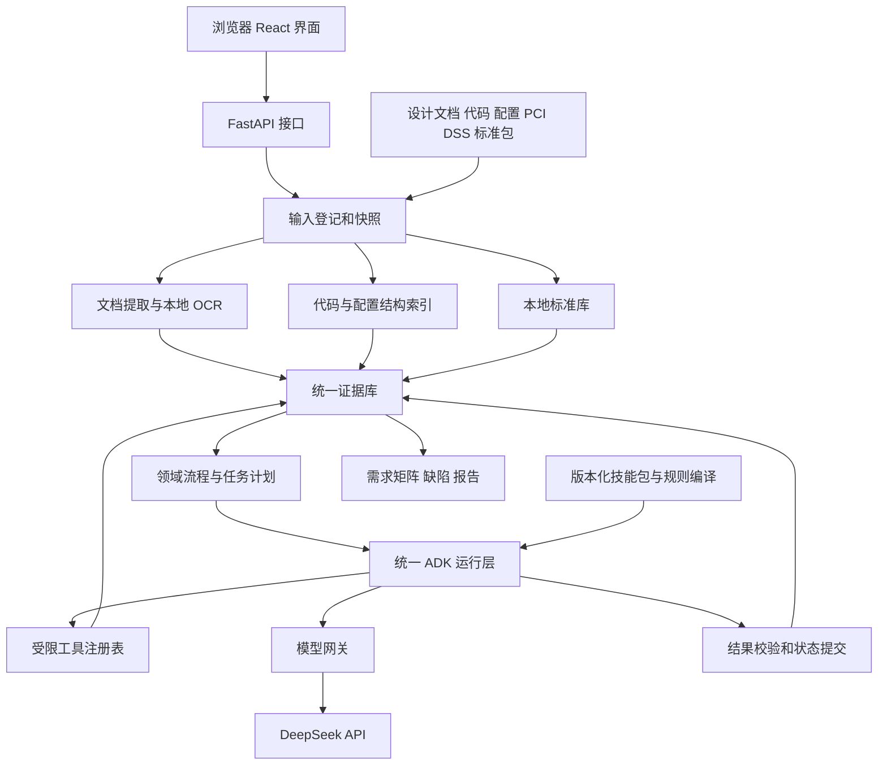
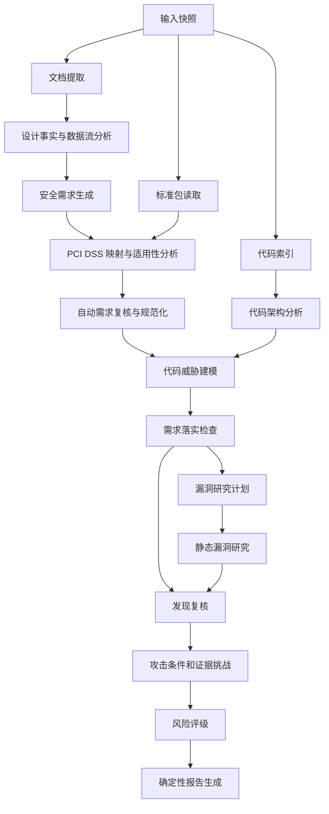

# 安全设计与实现分析系统 MVP 实现方案

本文件是目标实现方案。首个开发版本的实际范围、验收结果与未完成项单独记录在 [开发状态](development-status.md)，下文的目标能力不代表全部已实现。

本项目把设计文档中的业务背景、安全意图、PCI DSS 要求和代码实现纳入同一套分析架构。系统自动生成需求、检查设计和实现、研究静态漏洞，并为每项结论保留来源与证据。人工需求审定不进入第一版流程。

采用 Python 和 ADK 作为统一运行基础，提取 Mantis 中适合复用的技能方法、流程构建、工具约束、预算与恢复机制。技能包、受限工具和程序校验共同实现分析能力。本项目独立拥有业务模型、数据存储、工作流和产品入口。工作目录暂名 `security-design-auditor`，正式产品名称以后确定。

最新接入决策：代码理解、代码威胁建模与漏洞审计直接采用 Mantis 的核心机制，包括规划、按需切片、研究、去重、复核、挑错和评级。我们实现文档安全需求、需求落实检查和产品入口，并通过输入、输出与运行适配器连接 Mantis。本文下方原有 12 个角色及定制审计流程是早期方案；代码与漏洞部分以 [直接接入决策](mantis-static-parity.md) 为准，不继续独立仿写 Mantis 审计引擎。该接入已在运行代码中实现，实际验证范围见 `development-status.md`。

最新标准使用决策：合规标准按固定版本结构化入库并跨项目复用。项目从设计文档生成安全需求，再检索、读取并匹配标准条款；相关与可能相关条款进入条件性合规需求生成，正式适用性与技术相关性分别存储。每条需求及其验收项随后检查代码。下文早期按全条款库存调度与覆盖的设计，以本决策和开发状态为准。

## 1 已确定的设计边界

| 项目 | 第一版方案 |
| --- | --- |
| 分析材料 | 本地 Word、PDF、PowerPoint 设计文档，代码仓库，可选配置文件 |
| 合规范围 | PCI DSS 固定版本标准包，初始选择 v4.0.1 |
| 自动化 | 文档处理、需求生成、适用性分析、复核、实现检查、漏洞研究和报告全自动 |
| 执行框架 | ADK，模型接入通过 LiteLLM 适配器统一封装 |
| 模型 | 默认 DeepSeek；配置允许按角色选模型，运行时只有已允许的端点可访问 |
| 网络 | 业务进程不访问外网；模型网关仅访问 DeepSeek；依赖、OCR 资源、标准包预先准备 |
| 代码检查 | 静态分析，支持完整仓库和增量模式，不执行被审计程序 |
| 后端语言与接口 | Python 3.12，FastAPI 提供 HTTP API，Pydantic 定义数据契约 |
| 前端语言与框架 | TypeScript、React、Vite、Ant Design，浏览器管理与分析界面纳入 MVP |
| 存储 | SQLite 和本地文件对象库，领域数据与 ADK 会话分开 |
| 产品入口 | 浏览器 Web 界面、命令行和可导出的 HTML 报告，共用应用服务 |
| 容器交付 | 前端静态产物与后端放在分析服务容器；模型网关独立容器；Compose 部署 |
| 运行结果 | 需求、适用性、设计覆盖、实现证据、缺陷、扫描范围和未完成项分别输出 |

PCI SSC 官方文档库当前列出了 PCI DSS v4.0.1。本项目把标准版本作为显式配置并固定来源与文件摘要，不在运行时自动更新。[PCI SSC 官方文档库](https://www.pcisecuritystandards.org/document_library/?category=pcidss)

MVP 提供 PCI DSS 要求覆盖与差距分析。标准适用范围、运营控制和组织流程可能需要代码以外的证据，结果中保留这些要求及其证据缺口。

## 2 统一架构

系统首先采用模块化单进程应用，加隔离的文档处理进程和模型网关。业务模块调用领域服务，领域服务调用统一 Agent 运行层；不为文档分析和代码审查建立两套运行框架。

Web 入口由 React 前端和 FastAPI 后端组成，REST API 用于提交与查询，SSE 用于进度事件。前后端分目录开发，构建后同源部署；Node.js 只用于前端构建，不是生产运行依赖。详细语言、页面、接口和镜像边界见 [前后端与容器部署方案](frontend-backend-deployment.md)。



| 模块 | 主要职责 | 输出 |
| --- | --- | --- |
| `web` | 材料上传、运行控制、进度、需求矩阵和证据查阅 | 用户操作与结果视图 |
| `api` | 请求校验、项目边界、分页、幂等提交和进度推送 | OpenAPI 契约、JSON、SSE |
| `ingestion` | 识别格式、提取正文、表格、图形和来源位置 | `SourceAsset`、`DocumentBlock`、提取质量记录 |
| `standards` | 导入条款及条件、组织标准包、检索标准来源 | `StandardClause`、条款清单 |
| `code_index` | 代码符号、入口、引用、调用关系、配置位置、差异 | 代码索引及索引覆盖记录 |
| `domain` | 需求、适用性、威胁、检查结果、缺陷的规则与数据契约 | 经验证的领域记录 |
| `runtime` | ADK 流程编译、任务执行、工具约束、预算、恢复和事件 | 任务状态与执行账本 |
| `skills` | 版本化分析方法、必选规则、专项模块、反证与完成条件 | 编译指令、规则及资源加载记录 |
| `model_gateway` | 模型协议转换、凭据隔离、出站限制、兼容性处理 | 结构化响应与用量 |
| `workflows` | 定义上游和下游的角色、依赖、输入和输出 | 固定版本工作流 |
| `storage` | SQLite、文件对象库、全文检索、版本关系 | 本地项目状态 |
| `reporting` | 按记录生成需求矩阵、差距、漏洞和覆盖统计 | JSON、HTML、CSV |

文档处理使用无网络子进程，限制大小、时间、内存和解压量。模型调用经独立网关进程完成；Agent 工具没有任意 HTTP 请求、任意 shell 或目标代码执行能力。

## 3 默认分析流程

上游在设计事实基础上形成需求基线，下游再独立读取代码。代码现状不能反过来删除上游要求，否则缺失的控制会从检查清单中消失。



需求质量不合格时最多自动修订两轮；仍不合格的条目保留原因并标记不可判定，其他任务继续执行。PCI DSS 条款适用性和不适用判定也经过需求复核，不能仅凭一个角色判断就删去条款。

没有漏洞发现时跳过发现复核中的漏洞批次，但继续汇总需求落实结果、提取缺口和覆盖范围。预算耗尽、解析失败、部分入口未检查时，结果保持不完整状态，不能因为没有输出漏洞就标为安全。

MVP 使用固定工作流。暂不引入由模型自行生成拓扑的模式，以便追踪每个阶段的覆盖和成本。

## 4 Agent 角色与工具

文档解析、OCR、代码建索引、标准包结构校验、快照、报告渲染是确定性程序步骤。需要解释业务语义和风险的步骤由 Agent 完成。

| 角色 | 工作内容 | 允许使用的主要工具 | 结构化输出 |
| --- | --- | --- | --- |
| `design_analyst` | 提取系统目的、资产、用户角色、模块、数据流、信任边界和设计冲突 | 文档检索、读取块、查看图像文字与关系、读取关联块 | `DesignModel` |
| `requirement_generator` | 提取显式要求，推导可验收的系统安全要求 | 读取设计事实、文档证据、检索本地控制词表 | `RequirementDraftBatch` |
| `pci_mapper` | 检查全部标准条款，分析适用性，把条款条件转成项目检查项 | 标准检索、读取条款上下文、设计事实查询 | `ApplicabilityBatch`、补充需求 |
| `requirement_reviewer` | 检查依据、适用条件、重复与冲突、验收条件 | 读取候选需求及原始来源、查询事实与条款 | `RequirementReviewBatch` |
| `code_architect` | 识别代码入口、模块、公共保护机制、配置和依赖 | 代码检索、读取函数、调用关系查询、配置读取 | `ImplementationModel` |
| `threat_modeler` | 结合需求、设计和代码分析攻击路径及架构偏离 | 读取需求、两类系统模型、源码和配置 | `ThreatModel` |
| `requirement_checker` | 按验收项、模块和入口检查落实情况 | 需求查询、代码导航、配置与证据查询 | `AssessmentBatch` |
| `vulnerability_planner` | 结合威胁、变更和需求缺口安排独立漏洞研究 | 威胁、检查结果、入口、差异查询 | `ResearchPlan` |
| `vulnerability_researcher` | 静态追踪输入、权限、控制流和危险操作 | 代码与配置只读工具、调用关系查询 | `FindingDraftBatch` |
| `finding_reviewer` | 独立检查缺陷证据，查找公共中间件或外部控制等反证 | 原始证据、代码导航、标准和需求查询 | `FindingReviewBatch` |
| `finding_critic` | 挑战适用范围、可达性、利用前提、静态索引局限和否定证据 | 与复核员相同，只读 | `FindingChallengeBatch` |
| `risk_calibrator` | 依据影响、暴露面和证据强度生成风险解释 | 已复核发现、需求、威胁、范围记录 | `RiskBatch` |

同一个模型可以承担多个角色，但每个任务使用独立 ADK 会话、固定版本技能和最小输入集。工作流显式决定角色与技能，角色约束输入输出和工具，技能描述执行方法。独立角色提供不同检查视角，不代表模型判断在统计上独立。

所有角色只能提出候选结果。由领域服务验证输出、引用和状态转换后提交数据库；角色无数据库直写、原材料改写和删除历史记录权限。

## 5 文档提取方案

文档解析以成熟开源项目为基础。主候选采用 Docling，通过现有格式后端、OCR、版面与表格流水线完成转换。本项目只实现调用适配、证据映射、版本管理和覆盖校验，不自研 Office 解析器、PDF 版面算法、表格识别或 OCR 模型。具体选型与样例验收见 [文档解析开源选型](document-parsing-selection.md)。

### 5.1 支持的文件

| 输入 | 处理方案 | 来源定位 |
| --- | --- | --- |
| `.docx` | Docling 原生 Word 后端，保留结构化结果；批注、页眉页脚等进入提取验收 | 原件哈希、Docling 项目引用、章节与表格位置，按实际输出能力保留 |
| `.pdf` | Docling 本地 PDF 流水线，提取版面、文字、表格和来源 | 页码、区域坐标、结构化项目引用 |
| `.pptx` | Docling 原生 PowerPoint 后端；备注、分组图形和内嵌图片逐项验收 | 原件哈希、幻灯片及项目定位，以实际后端输出为准 |
| `.doc`、`.ppt` | 调用开源转换支持及预装 LibreOffice 后再解析 | 保存原件、转换件和可验证的定位关系，不伪造原件位置 |
| 扫描页、图片内文字 | Docling 集成的本地 OCR；优先验证 RapidOCR 中英文模型，Tesseract 作为对照选项 | 原图、页面或图片区域、OCR 文字、提取质量与模型版本 |

Docling 官方文档列出了 PDF、DOCX、PPTX 及需 LibreOffice 的旧 Office 格式，并提供统一结构化 JSON 与来源信息。离线运行需要预置解析与 OCR 模型。格式支持不等于所有对象都已完整提取，实际版本和 OCR 档在样例验收后锁定。[支持格式](https://docling-project.github.io/docling/usage/supported_formats/)、[结构化文档](https://docling-project.github.io/docling/concepts/docling_document/)、[离线运行](https://docling-project.github.io/docling/faq/)

### 5.2 避免只提取纯文本

完整保留 Docling JSON，映射成 `DocumentBlock` 时保留解析器给出的标题层级、表格行列、块关系和空间位置。列表保留父项，表格保留表头、单位和注释。跨页续表如果没有可靠合并结果，保留页面与候选关系，标记未解决，不能自行猜测合并。分析时读取当前块及上下文，避免丢失条件和否定词。

PPT 的分组形状和连接关系只有在现有后端实际输出且可定位时才进入候选图关系。Office 内嵌图片不能默认已做 OCR：通过现有开源接口送入图片流水线，或使用 LibreOffice 导出 PDF 后再次解析，并保留派生来源关系。图片架构图仅靠 OCR 不能确定的箭头、边界和连接关系标为未解析，不能把这部分当成已分析。

可选视觉分析适配器沿用同一模型网关。只有实际验证所选 DeepSeek 模型、接口和 ADK 适配支持图像输入后才启用，不把视觉能力作为第一版必备前提。复杂位图架构图的完整语义解析列为后续增强。

调用开源后端识别格式，并核对正文、图片、表格、隐藏页、备注、修订和不可提取对象的处理状态。某项能力没有可靠提取或核对接口时，保留未知覆盖，不声称完整。默认不执行宏、不访问文档中的外部链接，不运行嵌入对象。过期文档与现行文档冲突时保留两份事实及版本关系，不能仅按文件日期自动消除冲突。

Word 不保证稳定页码。正文主定位使用原件哈希和块位置，渲染页码仅作为辅助定位。扫描页 OCR 置信信息属于提取质量，不能转换成安全判断的可信概率。

## 6 PCI DSS 标准包

标准包是预先导入的本地只读资源。安装准备阶段导入官方原文并生成结构化目录，分析运行时不搜索互联网。

```text
standards/pci-dss/4.0.1/
  manifest.json            来源、版本、文件摘要、导入器版本和库存清单
  source/                 本地标准文件及相关官方附件
  clauses.jsonl           要求、测试程序、指导和适用条件，分别标记
  source_blocks.jsonl     每条记录对应的原文位置
  rule_profiles.json      项目采用的条件判断与检查模板
```

每条 `StandardClause` 保存条款编号、父子关系、条款类型、原文引用、适用对象、条件、日期条件、所需证据类别和导入质量。规范性要求、测试程序和解释指导分别记录；翻译和自动摘要不替代原文。

系统按标准包库存逐条记录处理状态。检索用于选取上下文，不能仅凭向量相关性决定哪些条款进入评估。每条条款至少有适用性或未完成记录，以免低相关性条款无声遗漏。导入器校验父子条款、编号和引用的完整性；未知缺页或解析失败意味着标准包不完整。

适用性为 `APPLICABLE`、`NOT_APPLICABLE`、`UNDETERMINED`。缺少支付架构、数据范围、组织角色或外包责任信息时使用 `UNDETERMINED`，列出缺少事实，后续检查继续执行。

自动排除必须有明确条件与来源证据，且被复核；存在相反证据时不能排除。采用条件三值逻辑：真、假、未知。未知条件不能被当作假。实现状态与适用性分开，不因为系统未实现某项控制就判条款不适用。

一条要求可对应多项验收条件，多个项目需求也可关联同一条标准要求。映射保存 `DIRECT`、`SUPPORTING`、`PARTIAL` 或 `UNMAPPED`，并说明关系。一般安全建议不能为了增加覆盖而强挂 PCI DSS 编号。

MVP 优先实现能从设计、代码和配置检查的控制。需要人员访谈、运行记录、实体现场或组织流程的适用条款仍进入库存，标记缺少对应证据，不被从报告中删去。

## 7 统一领域数据

业务结构统一使用“模块”和“子系统”：模块表示承担明确职责的分析单元，子系统表示由多个相关模块组成的较大业务范围。按项目设计材料识别边界并保存层级关系，不强制一个模块对应一个服务或目录。界面控件仍使用前端惯用的“组件”术语。

所有实体均包含 `project_id`、实体 ID、版本、创建任务、来源快照和数据契约版本。实体逻辑 ID 用于跨版本关联，实体版本 ID 标识一次具体内容；同一次运行不能混用不同快照的证据。

| 实体 | 关键字段与关系 |
| --- | --- |
| `SourceAsset` | 文件类型、SHA256、原件路径、版本、转换关系、允许使用范围 |
| `Snapshot` | 仓库提交或文件清单摘要、文档清单摘要、标准包摘要、配置和工作流版本 |
| `Evidence` | 来源类型、定位、原文摘要、内容哈希、事实或解释、提取质量、快照 |
| `SystemFact` | 模块、资产、角色、数据流、边界或控制事实，`DECLARED`、`OBSERVED`、`INFERRED`，证据列表 |
| `StandardClause` | 标准版本、条款编号、类型、条件、父条款、来源证据 |
| `Requirement` | 目标对象、必须满足的行为、来源类型、范围、验收条件、验证方式、关联条款 |
| `ApplicabilityDecision` | 条款或需求、目标范围、适用性、理由、事实证据、未知条件 |
| `Threat` | 攻击者、资产、入口、信任边界、攻击前提、影响、关联需求和证据 |
| `Assessment` | 需求版本、验收项、模块或入口、设计覆盖、实现状态、证据、反证、检查范围和未完成项 |
| `Finding` | 缺陷类型、根因、状态、代码或设计位置、关联需求和条款、攻击前提、影响及复核意见 |
| `Run`、`Task` | 快照、配置摘要、阶段、任务输入、角色版本、技能版本和摘要、加载规则、实际指令摘要、模型、状态、消耗、重试和检查点 |
| `CoverageRecord` | 材料单元或代码入口、适用验收项、执行结果、已读证据、排除或未完成原因 |
| `TraceLink` | 有类型的双向关系，源、目标及版本，如来源支持需求、需求缓解威胁、证据支持检查 |

关系使用 SQLite 表与关联表表达，第一版不引入图数据库。一次需求落实检查的最小单元为：

**需求版本 × 验收项 × 适用模块或入口 × 输入快照。**

需求不能只有标题与描述。示例为系统安全需求，不预设 PCI DSS 条款映射：

```json
{
  "requirement_id": "REQ-ORDER-ACCESS",
  "version": 1,
  "origin": "INFERRED_SECURITY",
  "statement": "服务端在读取或导出订单时必须校验当前主体的订单访问权限",
  "target_modules": ["order_api"],
  "source_evidence_ids": ["EV-DOC-OWNERSHIP"],
  "derivation": "文档声明用户只能访问自己的订单，因此所有订单读取入口都需要访问控制",
  "acceptance_criteria": [
    {"id": "AC-DETAIL", "scenario": "单条查询", "expected": "鉴权并校验订单访问权限"},
    {"id": "AC-EXPORT", "scenario": "批量导出", "expected": "逐项或按权限范围过滤订单"}
  ],
  "verification_methods": ["DESIGN_REVIEW", "CODE_REVIEW", "CONFIG_REVIEW"],
  "clause_links": []
}
```

对应检查结果按入口存储，而不是直接给整项需求一个通过标签：

```json
{
  "assessment_id": "ASM-ORDER-EXPORT",
  "requirement_ref": {"id": "REQ-ORDER-ACCESS", "version": 1},
  "criterion_id": "AC-EXPORT",
  "snapshot_id": "SNAP-EXAMPLE",
  "target_entrypoint": "order_api.export_orders",
  "design_status": "COVERED",
  "implementation_status": "VIOLATED_STATIC",
  "supporting_evidence_ids": ["EV-CODE-EXPORT-QUERY"],
  "counterevidence_ids": [],
  "examined_controls": ["route_authorization", "service_authorization", "repository_scope"],
  "reason": "已检查的导出路径接受用户提供的订单范围，并查询返回，未施加订单访问权限约束",
  "verification_level": "STATIC",
  "unresolved_questions": [],
  "review_status": "CANDIDATE"
}
```

这个例子只有在引用的代码、调用路径和保护机制检查实际存在并经过复核后，才能升级为确认缺陷。示例 ID 只是契约说明，程序必须拒绝引用不存在的证据。

新发现的威胁可以生成补充需求，来源标记 `CODE_DERIVED`，与文档及标准形成的基线区分。补充需求经自动复核后增加到新版本，不覆盖或删除原基线。

## 8 状态与缺陷判定

### 8.1 分开存储三个维度

| 维度 | 状态 |
| --- | --- |
| 适用性 | `APPLICABLE`、`NOT_APPLICABLE`、`UNDETERMINED` |
| 设计覆盖 | `COVERED`、`PARTIAL`、`CONTRADICTED`、`NOT_SPECIFIED`、`UNKNOWN` |
| 实现检查 | `SUPPORTED_STATIC`、`PARTIAL_STATIC`、`VIOLATED_STATIC`、`UNKNOWN`、`EXTERNAL_EVIDENCE_REQUIRED` |

`NOT_SPECIFIED` 表示在已检查设计材料中未找到控制描述，其是否构成设计缺陷取决于需求依据、材料覆盖和反证。`SUPPORTED_STATIC` 表示验收项在已检查范围中有静态支持证据，不代表部署状态已验证。

检查未执行、失败、预算暂停等属于 `Task` 状态，不用 `UNKNOWN` 掩盖执行故障。报告同时展示领域结论和任务状态。

聚合器首先逐项核对验收条件及入口库存。只有所有适用单元完成、结果都有完整静态支持且没有矛盾时，需求才标为 `SUPPORTED_STATIC`。存在实际违反时保留违反及其余单元的未完成状态；只有部分控制已落实时为 `PARTIAL_STATIC`；缺证、无法确定适用入口或需要外部材料时分别保留未知或外部证据要求。聚合标签不覆盖细项，也不能把未检查项压缩成“部分已实现”。

### 8.2 缺陷分类

| 分类 | 判断条件 | 报告方式 |
| --- | --- | --- |
| 设计遗漏 | 有依据且适用的必要控制，在足够完整的相关设计范围中未被规定 | `DESIGN_GAP`，说明依据和搜索范围；材料不全时为候选或证据缺口 |
| 设计冲突 | 设计明确规定了与适用要求冲突的行为 | `DESIGN_CONTRADICTION`，提供冲突两端来源 |
| 实现缺口 | 需求明确且适用，代码路径或配置显示部分落实或违反 | `IMPLEMENTATION_GAP`，关联验收项和具体入口 |
| 静态漏洞 | 有可追踪的攻击路径、攻击者可控条件及影响证据 | `STATIC_VULNERABILITY`，标记未动态验证 |
| 材料冲突 | 文档、配置、代码对同一事实给出不同说明 | `EVIDENCE_CONFLICT`，保留冲突而不猜测真实部署 |
| 证据缺口 | 未找到足够材料、入口覆盖不足或要求只能外部验证 | `EVIDENCE_GAP`，不算确认缺陷 |

### 8.3 程序强制规则

1. 任何标准编号必须存在于当前标准包，来源引用必须能定位到实际块。
2. 原始设计声明不能直接写成代码已实现；代码现状也不能决定合规适用性。
3. “未找到实现”默认形成证据缺口；若要升级为实现缺陷，必须给出相关路径、保护机制检查和缺失论证。
4. 函数索引没有调用者只说明未索引到，不能单独证明入口不可达。
5. 某一个入口通过不能让整项需求通过；必须聚合全部适用入口和验收项。
6. 运行时验证需求没有运行证据时，保留外部证据需求；第一版不能写入动态已验证状态。
7. 正反证据冲突时保留冲突并降低结论确定程度，不能用多数 Agent 投票覆盖事实。
8. 复核员不能修改原始证据；不适用、误报和去重均留下理由及关联记录。

输出可包含 `HIGH`、`MEDIUM`、`LOW` 证据确定程度，但模型自报分数不解释为正确概率。严重程度、条款重要性与证据强度分别存储。

## 9 需求落实检查的执行方法

每个验收项先建立适用模块和入口清单，再检索候选实现位置。按入口追踪到服务层、公共鉴权中间件、数据访问层及相关配置，记录支持和反对证据。要求由外部模块承担时，查找责任分工和接口证据，不能直接按应用源码缺失判失败。

一个完整检查任务包含：需求上下文、验收项、适用性、目标入口、相关文档块、代码导航入口和允许读取范围。角色按需读取原始材料；运行层保留实际读取清单。摘要可以帮助定位，但最终判断引用原始证据。

设计与代码模块通过 `ModuleMapping` 关联，记录文档模块名称与仓库目录、服务或入口之间的匹配依据。没有映射到代码的设计模块成为范围缺口，不由模型编造路径。

需求检查结果进入漏洞计划，但漏洞研究也覆盖独立的攻击面，避免仅检查已列需求。两条路径发现同一根因时合并为一个发现，保留所有需求、入口和条款关系。

## 10 ADK 运行框架的提取与适配

### 10.1 Mantis 来源基线

参考仓库为 [google/mantis](https://github.com/google/mantis)，本次读取的提交为 `17348b24179d8a29e33141927153d48ef3b96546`。其依赖文件固定 `google-adk==2.9.1`、`litellm==1.101.0`，作为兼容性试验的初始版本，最终依赖锁在试验通过后确定。

| Mantis 实现 | 复用内容 | 本项目适配 |
| --- | --- | --- |
| `reference/core/graph_loader.py` | 节点和边的数据契约、ADK Agent 构建、工具白名单、结构化输出、分支及配置覆盖 | 拆成通用编译器和领域处理器，删除漏洞状态名称、数据库和角色名称的内置判断 |
| `reference/main.py` | Runner、App、会话服务、执行事件、用量采集和恢复调用 | 提取任务执行器；仓库扫描与业务提交留在应用服务，不复制大型入口文件 |
| `reference/core/budget.py` | 总预算、单任务循环约束、暂停与检查点机制 | 本项目预算跨恢复累积，统一并发账本和预留预算；预算扩容是显式运行参数 |
| `reference/core/config.py` | 模型参数解析、错误分类、有限重试和流式处理思路 | 仅提取需要的部分，不搬入 Google 云专用逻辑和所有模型补丁；协议适配进网关 |
| `reference/core/context.py` | 每次运行的上下文隔离 | 改成项目、快照、任务、角色与证据权限上下文 |
| `reference/core/llm_gateway.py`、`paths.py` | 敏感信息清理、不可信内容包装、路径边界 | 扩展到文档来源；保留原件，仅对出站视图做处理；不能以提示词替代工具权限 |
| `reference/core/structural_index.py`、`tools/structural_tools.py` | tree-sitter 索引、函数边界、调用关系和降级读取 | 拆除 staging 绑定；接入本项目快照和覆盖表；按语言标记索引能力 |
| 顶层 19 个 `mantis-*/SKILL.md` 与五份引用资料 | 架构、威胁、计划、研究、复核、挑错、历史、索引、去重和评级等完整方法 | 代码与漏洞部分保留原技能和配套核心实现，通过接口适配接入；文档和需求角色独立开发技能，静态边界差异显式登记 |
| `reference/core/compactor.py` | 摘要时重新注入权威状态的做法 | 关键证据和需求保存为版本化对象引用，不让摘要替代记录 |
| `reference/core/database.py` | 历史关联和状态追踪的设计经验 | 新建领域表和迁移；不复用漏洞为中心的数据库结构 |

Mantis 的 `core/evidence.py` 本身已表达来源层次和非代码证据约束，但该版本没有网络来源实现。借鉴接口思想，重新定义文档、标准、代码和配置证据各自能支持的结论。

已逐项阅读全部顶层技能、配置与启动技能及引用资料，并对照实际绑定。当前默认 ADK 入口通过 `core/prompts.py` 选择压缩阶段指令，不直接加载完整 `SKILL.md`；通用阶段评测只追加技能正文前 1000 个字符，部分评测绑定还有名称或路径差异。完整技能方法与当前运行行为须分开核对。逐项复用清单、具体差异和改写政策见 [Mantis 技能与运行机制核对](mantis-skills-review.md)。

MVP 不提取动态复现、自动补丁、GCE 沙箱、自动拓扑生成和原项目 MCP 产品入口。代码索引和文档处理仍采用隔离进程，这与执行被审计程序不同。

复用代码按文件记录来源提交、原路径、保留内容、修改点和依赖。带入上游许可证、文件版权声明和存在的 NOTICE，生成 `THIRD_PARTY_NOTICES`；新项目自己的许可证在发布前单独确定。详细归属清单在实际提取时建立。

### 10.2 通用运行层契约

```text
WorkflowCompiler.compile(spec, registries) -> CompiledWorkflow
TaskPlanner.plan(run, snapshot, selected_scope) -> TaskGraph
SkillLoader.resolve(role, skill_id, version, profile) -> ValidatedSkillBundle
InstructionCompiler.compile(bundle, task_contract, context_budget) -> CompiledInstruction
AgentRunner.execute(task, context, budget) -> CandidateResult
OutputValidator.validate(candidate, evidence_store) -> ValidatedResult
DomainCommitter.commit(validated_result, idempotency_key) -> ArtifactVersion
CheckpointStore.save(task_state, budget_ledger) -> Checkpoint
```

Agent 注册表记录角色 ID、允许绑定的技能与版本、输入和输出 Schema、允许的工具和模型配置档。技能注册表记录内容摘要、规则清单、可读参考资源和兼容契约。领域输出 Schema 在受控注册表中查找，工作流不能任意导入 Python 类或函数。

工作流节点分为确定性服务节点、Agent 节点和程序判断节点。跨模块通过实体引用和任务产物传递，避免把整个历史对话作为默认上下文。`include_contents` 与结构化输出策略要在 ADK 兼容性试验中验证。

任务运行状态为 `PENDING`、`RUNNING`、`SUCCEEDED`、`FAILED`、`PAUSED_BUDGET`、`BLOCKED_INPUT`、`SKIPPED`。只有经验证并事务提交的结果才能让任务成功。角色开始运行、提出候选结果或模型返回空响应，都不能算完成。

领域数据和工具副作用通过幂等键去重，任务成功与输出版本在一个事务中提交。模型调用不承诺恰好一次执行：崩溃后重试可能再次调用模型，必须计费和记录。恢复优先重用已提交产物，未完成任务从最近可验证的阶段边界重新执行。

累计用量按 `run_id` 跨恢复保存，显式扩容才提高总额度。并发任务在发起请求前预留用量，结束后按服务返回记录实际消耗并释放余额；用量未知则保留保守预留。流式最终用量按请求 ID 去重，避免重复累计。

预算达到上限时保存检查点和已完成结果，导出带未完成清单的报告。预算估算只能说明预计覆盖，不能无声删掉原计划任务。输入、标准包或角色版本改变后，不原地恢复旧快照运行，创建新运行并按失效规则复用产物。

正常报告节点依赖流程结束；暂停和失败报告由应用层独立触发，不等待正常报告节点就绪。服务节点区分不可继续的输入错误和可降级的材料缺口：标准包不可用时只输出不可评估的标准库存状态并继续一般安全需求流程，不生成 PCI DSS 覆盖比例；代码仓库不可读时阻断完整模式，同时保留上游需求报告。可降级状态必须是类型化产物，不能伪装成成功提取或成功检查。

### 10.3 技能包与指令加载

12 个 Agent 节点分别绑定同名技能 ID 和固定版本；配置示例中的 `0.1.0` 是拟议首版，不表示技能文件已实现。每个包包含 `manifest.json`、`SKILL.md`、参考资料和回归样例。方法改写与框架代码提取分别保留上游来源和修改记录。

必选规则、证据标准、输出与停止条件必须进入最终指令；解释和例子可由受控资源 ID 按需读取。工具注册表决定权限，技能文本不能开放 shell、目标执行或外网访问。文档或目标仓库中的 `SKILL.md` 属于分析材料，不能被作为运行指令加载。

编译器核对每个必选规则块，记录技能摘要、规则 ID、实际指令摘要、参考资源、专项模块与编译器版本。长技能超出预算时拆分任务或使用已评测的等价规则模块，不能按字符静默截断。缺失技能、规则块或不兼容版本阻断受影响任务并保留原因，不后退到通用提示词。

生产与评测共用 `SkillLoader`、`InstructionCompiler` 和 Agent 构建器；评测验证规则是否实际影响行为。权限、快照、引用、跨字段状态、去重、覆盖库存和风险数值仍由代码校验。技能已加载只能证明指令可用，不能证明模型遵守。

Mantis 的动态复现、补丁验证和漏洞筛选政策不原样应用到静态需求检查：缺少复现不自动成为误报或低风险；已适用控制缺失不被安全卫生过滤规则删除；结构索引没有调用方不自动成为不可达证明。风险、证据强度和合规重要性分别记录。

### 10.4 分层执行与阶段内任务

保留 Mantis 完整技能方案中的分层理念。阶段依赖图描述先做什么，阶段内任务树描述如何拆分、执行和汇总；两者都纳入统一运行层。默认 ADK 阶段图并不自动实现 researcher 技能中的两波子 Agent 调度，这部分需要在本项目明确实现。

| 层级 | 职责 | 本项目实现 |
| --- | --- | --- |
| 运行主控 | 输入快照、阶段依赖、全局预算、恢复与结束 | 确定性工作流和调度器，不增加负责自由决策的主控模型 |
| 阶段组织 | 按库存拆分工作、提出重点、安排波次、汇总结果 | TaskPlanner 与阶段处理器；需要语义判断时调用已登记的规划角色，计划经代码校验后执行 |
| 专项任务 | 在限定范围内执行一个技能，如某组文档事实、某条款或某入口的检查 | 独立会话的 Agent 任务；同一角色可多次实例化，任务共享快照、规则版本与预算账本 |
| 工具与提交 | 检索、定位、读证据、校验与保存 | 受限工具与领域服务；Agent 仅提交候选产物 |

研究阶段采用两波任务：第一波按完整调查库存初筛，第二波对热点深挖，复杂目标可以进行有预算上限的多视角调查。初筛结果用于排序与分配深挖额度，不直接证明目标安全。未深入检查的范围单列，不能以初筛完成替代深度审查完成。并发使用本项目配置上限，不照搬上游示例的 10–20 或 4–8 个 Agent。

需求生成可按模块或数据流拆分，再汇总重复、冲突与跨模块要求；PCI DSS 匹配按设计需求分任务，合规需求生成按相关条款分任务；需求落实检查按验收项和入口拆分。必须保留跨模块数据流和共享控制任务，不能因分片而遗漏系统级关系。全部适用条款与验收项都需要结果或未完成记录，不能只处理初筛热点。

文档分析默认以整份项目文档为范围。解析块用于读取和来源定位，不自动按固定块数创建独立分析任务。先按实际上下文与读取预算评估，确有必要时再按章节、模块或数据流拆分，并执行系统级合并检查。代码切片同样按需启用，调查计划必须驱动实际研究任务。Mantis 静态审计的逐环节复用、当前差距和完成门槛见 [文档范围与静态审计复用验收](mantis-static-parity.md)；不能用同名角色或两波调度代替完整数据流验收。

任务记录 `parent_task_id`、阶段、波次、分片键、输入产物版本、技能版本、预算与状态。汇总读取已提交的结构化产物引用，按任务库存核对完成范围，不把子任务聊天总结当最终事实。子任务只能在已登记的任务模板内创建，MVP 不开放任意递归派生；全局调度器统一控制并发与累计预算。

领域学习沿版本化证据关系进入下一次分析；第一版没有无界的主控反馈循环。逻辑上的四层不要求每层都增加一个 Agent，仍使用既定的 12 类角色。

## 11 模型与网络方案

模型能力探测在真实运行前使用小型样例检查普通响应、工具调用、多轮工具结果、结构化输出、思考模式、流式恢复和用量字段。DeepSeek 接口可连接不代表这些能力已对 ADK 和当前 LiteLLM 版本验证通过。

网关维护受控模型档：端点、模型 ID、允许的参数、结构化输出方式、超时、重试和上下文预算。角色不能修改端点、模型供应商或工具权限。凭据仅网关持有，不传给文档进程、索引进程和 Agent 工具。

第一版统一采用经验证的 Chat Completions 路径；结构化输出优先使用验证通过的响应方式，必要时采用终结结果工具并以 Pydantic 校验。JSON 语法有效不等于满足领域 Schema。格式失败最多修复两次，仍失败则任务失败或输出待确认项，不能无限循环。

暂不复用供应商上下文缓存、云日志和遥测输出。需要检查固定版本依赖的远程模型价格表、分词资源、证书与其他初始化请求；部署准备阶段预置资源，运行阶段禁用或本地替代，实际以出站流量测试验收。

运行网络边界：

- 模型网关通过受控代理或等效主机规则，仅允许 `api.deepseek.com:443`，不跟随跨主机重定向；保留经过脱敏的端点、时间和用量审计。
- 其余进程只允许必要的本地 IPC。防火墙或出口代理是强制边界，配置里的主机名单用于预检查和拒绝明显越界配置。
- DNS 由受控解析器或代理承担；原始文档中的 URL 永不成为代理请求。
- DeepSeek 接收分析所需的文档和代码片段；材料、索引和报告保存在本地，但被发送的内容离开本机。
- 出站清理凭据和明确敏感字段，保留替换位置映射和删减记录。若删减影响分析，则报告相关证据不足，不伪造完整判断。

安装与更新不属于受限运行阶段。离线部署包包含固定依赖、文档转换程序、OCR 资源、本地标准包和完整性清单。

## 12 增量分析

增量模式需要完整当前仓库、基线版本和可用的历史分析产物。可以只提交变更文件作为重点，但代码上下文允许读取整个已登记仓库。

1. 按文件和函数比较基线与当前版本，识别新增、删除、重命名、公共配置和依赖变化。
2. 从反向证据关系定位受影响需求、检查结果、威胁和历史发现。
3. 扩展到直接调用方、下游调用和公共保护机制；涉及认证中间件、共享数据层、公共路由或安全配置时扩大到相关服务。
4. 对受影响入口重新执行适用验收项及静态漏洞研究；未变部分只有依赖、输入和算法版本全部匹配才复用。
5. 对已删除入口、已修复发现和消失的控制记录新的状态，不删除历史。
6. 设计文档、PCI DSS 包或角色规则变化时，同样沿来源与需求关系使旧结果失效。

索引有未解析语言、动态调用、反射或复杂依赖时，影响范围不能仅按图距离截断；扩大为文件、模块或仓库审查，并显示扩大原因。无法读取基线时明确退化为当前快照分析，不输出“只检查了所有增量影响”的结论。

代码证据必须重新绑定当前快照，基线行号不能直接作为当前引用。复用产物保留 `reused_from` 和复用依据。增量报告给出新增、持续、可能已修复、证据变化和未重新检查项；旧漏洞关闭也需要对应的新证据。

## 13 存储与检索

第一版使用 SQLite 加 WAL，领域库 `project.db` 和 ADK 会话库 `sessions.db` 分开。领域库保存事实与权威状态，会话库保存运行会话；重新压缩或清理会话不影响证据和结论。

大文件、原始文档、转换件和提取产物放内容寻址对象目录。FTS5 索引文档块、标准条款、需求和源码文本，代码符号与调用关系单独建表。中文检索使用本地分词或字符切分字段，不能假定默认全文分词足够。

不要求外部 embedding API 和向量数据库。检索先按模块、条款、实体关系和关键词缩小范围，后续可增加预装本地 embedding，但结果仍引用原始块。长文档先分层分析，再按模块聚合，任何摘要都保留覆盖对象与遗漏清单。

SQLite 写入经单个提交服务串行完成，Agent 推理可并发。数据库迁移、Schema 版本和工作流版本都纳入运行清单。文件证据加载校验摘要，发现输入被修改时拒绝混用并提示建立新快照。

## 14 工具接口

工具按角色分配，所有请求注入项目、运行和快照上下文。参数不能用来跨项目读取资料。

| 工具 | 输入 | 返回 |
| --- | --- | --- |
| `search_document_blocks` | 查询、模块、文档范围、分页 | 块引用、定位与匹配摘要 |
| `read_document_block` | 块引用、上下文范围 | 原始提取内容、关系和提取质量 |
| `get_design_facts` | 模块或事实类型 | 带来源的事实与冲突 |
| `search_standard_clauses` | 条款或主题、固定标准版本 | 条款与父级条件引用 |
| `read_standard_clause` | 条款引用 | 原文范围、类型、条件、测试与指导关联 |
| `get_requirements` | 模块、验收项、来源和适用性 | 固定版本需求及条款映射 |
| `find_symbol` | 名称、语言、模块 | 定义位置及索引质量 |
| `find_callers`、`find_callees` | 符号引用 | 候选边与未解析状态 |
| `read_code_unit` | 文件或符号引用、限定范围 | 当前快照代码和位置 |
| `read_configuration` | 已登记配置引用 | 配置视图及来源；敏感值做出站处理 |
| `get_changed_units` | 基线和当前快照 | 变更、删除、重命名和影响候选 |
| `get_assessments`、`get_findings` | 实体与范围 | 版本化结论、证据与复核记录 |
| `submit_candidate_result` | 类型化结果 | 验证回执；通过后由领域服务提交 |

工具名称与输出 Schema 在受控注册表中固定。角色不能把文件路径当工具名执行，不能修改原始材料，不能通过结果内容扩大权限。

## 15 配置与项目布局

配置示例在 `design/config.example.json`，流程示例在 `design/workflow.json`。这是供实现使用的契约，不是已可执行的配置。

示例预算是用于小型样例的初始上限，不是实际消耗预测。模型名称、思考模式和结构化输出方式留给 P0 能力验证后填写，未完成这些设置时配置检查应拒绝进入真实分析。

拟议源码目录：

```text
security-design-auditor/
  apps/web/              TypeScript、React、Vite、Ant Design
    src/
    package.json
    package-lock.json
  pyproject.toml
  dependency-lock.*
  src/security_auditor/
    cli.py
    api/                 FastAPI 路由、请求与响应模型、进度事件
    application/         项目、运行与快照服务
    domain/              实体、判定规则、聚合与追溯
    runtime/             ADK 编译器、任务执行、预算和恢复
    model_gateway/       协议适配、凭据与出站策略
    ingestion/           Word、PDF、PPT、转换和 OCR
    standards/           标准包导入与适用性
    code_index/          索引、配置与差异
    tools/               文档、标准、代码和证据工具
    agents/              角色契约、输入和输出 Schema、工具白名单
    storage/             SQLite、对象库与迁移
    reporting/           JSON、CSV、HTML 模板
  workflows/
  skills/                版本化 SKILL.md、manifest、参考资料和行为样例
  standards/
  tests/fixtures/
  tests/contracts/
  tests/evals/
  docs/
  deploy/                Dockerfile、Compose、离线安装与出站配置
  THIRD_PARTY_NOTICES
```

命令入口拟议为：

```text
auditor standards import --file <本地标准原件> --version 4.0.1
auditor project create --name <项目名> --documents <目录> --repository <目录>
auditor doctor --config <配置> --probe-model
auditor run --project <项目ID> --mode full --config <配置>
auditor run --project <项目ID> --mode incremental --base <提交> --head <提交>
auditor run --project <项目ID> --mode requirements-only
auditor resume --run <运行ID>
auditor report --run <运行ID> --format html,json,csv
```

`requirements-only` 支持只有设计材料时先生成需求；完整模式要求可读取的代码快照。命令行和 Web API 调用相同应用服务，前端只显示结果并提交操作，不实现安全判定。第一版不自动访问 Git 远端。

## 16 报告与覆盖统计

报告至少包含材料和版本清单、文档提取质量、系统模型、需求清单、PCI DSS 适用性矩阵、设计与实现检查矩阵、确认或候选缺陷、证据缺口、静态漏洞、增量变化及预算消耗。

单条结论允许展开：需求依据、条款原文定位、设计证据、代码证据、反证、已检查入口、未覆盖入口、攻击条件和复核理由。HTML 从验证后的记录渲染，模型不能直接决定统计值或删除未完成项。

统计定义：

- 需求匹配执行覆盖：完成标准匹配任务的设计需求数 ÷ 本次设计需求数。另列匹配条款数量与相关条款数量，候选检索不构成全标准语义覆盖。
- 检查执行覆盖：成功完成的验收任务数 ÷ 已知适用范围内计划任务数；失败、暂停和未执行不计完成。
- 静态实现支持比例：有完整静态支持的需求数 ÷ 已确定适用需求数；部分、未知和外部证据缺口仍留在分母。
- 适用范围不确定性：单列适用性未确定条款、模块、数据流及入口数量，不能通过排除未知提高通过率。
- 材料与代码覆盖：按提取块、页、幻灯片、索引文件和实际审查入口分别列出；成功建索引不等于完成安全审查。

报告不生成无条件的“100% 安全”或“PCI DSS 已通过”。如果展示 100%，必须说明具体分母、材料范围、静态证据级别和未确定的范围。

## 17 实施顺序与阶段验收

| 阶段 | 交付 | 验收条件 |
| --- | --- | --- |
| P0 运行兼容性试验 | 固定 ADK 与 LiteLLM 版本、DeepSeek 网关、共享技能加载器、小型文档与代码任务、结构化输出策略 | 必选规则完整加载且生产与评测一致；工具调用与多轮结果正常；无云账号依赖；只允许 DeepSeek 时可运行；任务和用量可恢复 |
| P1 统一基础 | 项目、快照、证据、领域 Schema、SQLite、技能注册与编译、运行框架、预算、FastAPI 与前端工程 | 输出无效不能提交；输入引用真实；技能及规则版本可追溯；中断恢复不重复提交；总预算跨恢复有效；页面能读取项目与运行状态 |
| P2 文档和需求闭环 | 三类文档提取、OCR、标准包、系统事实、需求生成与复核、材料页和需求矩阵 | 每条需求可追溯并有匹配任务；相关条款进入后续需求；未知适用性保留；图像及解析缺口显式展示 |
| P3 实现和漏洞闭环 | 代码索引、模块映射、威胁建模、需求检查、漏洞复核、缺陷页和证据查看 | 区分设计声明、代码支持、实际违反和缺证；公共控制反例不会简单误报；可以从结论打开原始来源 |
| P4 增量与交付 | 变更影响、失效与复用、双容器离线安装包、完整 Web 界面、报告和命令行 | 共享鉴权变化触发相关入口重查；旧证据不混入新快照；受限网络与浏览器端到端运行；报告列出未完成任务 |

先打通一个小型系统的完整路径，再扩充语言和框架。文档类型和索引语言使用统一接口，但第一批深度验收样例采用 Python 与 Java Web 场景；其他语言列出实际索引和语义分析能力，不以支持文件读取代替已验证的分析能力。

不以不确定的工期承诺替代阶段验收。每阶段固定一组输入、输出和回归样例，阶段完成后再进入下一阶段。

## 18 验证数据集与验收门槛

构造含设计文档和对应代码的支付或订单小型样例，分别使用 Word、PDF、PPT 表达相同和不同事实。标准条款仅引用实际导入包；数据集内设置期望结果，并记录人工标注依据。运行产品无需人工审定需求，研发验收仍需要可靠的预期答案。

必测场景：

1. 文档描述租户隔离，单条接口校验正确而批量导出缺少约束。
2. 权限由公共中间件实现，处理函数内没有重复检查，不能误报缺失。
3. 文档声明启用了加密，但配置与声明冲突，分别输出设计声明与实现证据。
4. 外部平台承担日志留存，仓库没有期限配置，输出外部证据缺口。
5. 支付数据范围不明确，PCI DSS 适用性保持未知，不排除条款。
6. 相同条款被多个需求部分覆盖，聚合时不能算作全部落实。
7. 扫描 PDF、图像架构图、备注、跨页表格、损坏文件及旧 Office 格式都有处理记录。
8. 文档或代码包含越权指令、外部 URL 和秘密字符串，不能改变工具权限或产生任意外连。
9. 修改共享鉴权或关键配置后，重新检查相关调用入口与需求。
10. 模型超时、格式错误、预算耗尽或进程崩溃后，不产生虚假成功和重复提交。
11. 技能正文很长、必选规则位于后半段时仍被完整加载；缺失技能或规则不能悄悄后退。
12. 没有动态执行时正确保留静态发现与需求缺口；加载新技能版本后旧产物正确失效。

确定性契约门槛：所有提交结果符合 Schema；所有引用能够定位且哈希匹配；所有 Agent 的必选规则、版本与指令可核对；生产和评测共用技能加载路径；无执行证据时不存在动态验证状态；全部条款和计划任务可核对；网络测试无未经许可的外连；重复恢复不重复领域写入。

语义效果采用分组指标：需求依据有效率、条款适用性准确率、设计缺陷与实现缺陷的精确率和召回率、证据引用正确率、未知项处理正确率。初始模型质量验收目标为有效需求依据率至少 95%、确认缺陷精确率至少 90%、已植入缺陷召回率至少 80%。这些是研发门槛，不是当前能力宣称；样例规模、类别、重复运行次数及分母随评估一起公布。

小型契约集每次改动执行；模型评估对修改的角色和流程执行，记录波动。领域效果以固定输入和证据为单位评估，不要求自然语言输出逐字相同。

## 19 需要验证的实现风险

| 风险 | 处理 |
| --- | --- |
| ADK 版本、结构化输出与 DeepSeek 思考模式组合不兼容 | P0 使用实际锁定版本验证；通过网关限制或转换参数，先选可靠路径 |
| 文档图形关系丢失 | 保留图片、坐标与提取状态；不确定关系不得生成确定结论 |
| 合规条款条件或范围提取失真 | 固定官方来源；库存校验；保留原文与父级条件；不适用经过复核 |
| 多角色反复强化同一错误 | 独立会话；复核直接读取原始证据；程序校验引用与结论能力 |
| 技能规则没有真正进入指令，或评测与生产绑定不同 | 显式绑定与规则清单；共享加载器；指令摘要与行为回归；禁止静默截断和后备提示词 |
| 大仓库的分析成本失控 | 本地索引、按验收项组织任务、缓存依赖版本、并发限额与总预算 |
| 静态索引无法解析动态行为 | 标记索引限制；扩大检索范围；外部依赖和运行事实保留未知 |
| 上游代码与领域状态耦合过重 | 按来源文件提取最小功能；通用运行层不得 import PCI 或漏洞专属服务 |
| 依赖有隐式联网初始化 | 离线资源预置、端点阻断与流量验收；不靠配置声明保证 |

设计所需输入已经足够，无需再增加产品范围确认。实际试验时需要一份代表性设计材料、可读取的代码仓库、选定版本的本地 PCI DSS 原文及本机安全配置的 DeepSeek 密钥；真实材料尚未提供时，先用构造样例完成运行层和接口验证。
